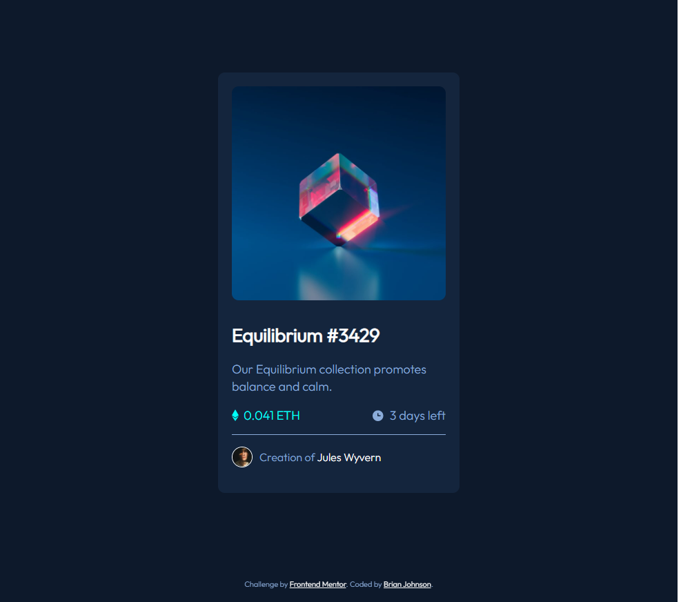

# Frontend Mentor - NFT preview card component solution

This is a solution to the [NFT preview card component challenge on Frontend Mentor](https://www.frontendmentor.io/challenges/nft-preview-card-component-SbdUL_w0U). Frontend Mentor challenges help you improve your coding skills by building realistic projects.

## Table of contents

- [Frontend Mentor - NFT preview card component solution](#frontend-mentor---nft-preview-card-component-solution)
  - [Table of contents](#table-of-contents)
  - [Overview](#overview)
    - [The challenge](#the-challenge)
    - [Screenshot](#screenshot)
    - [Links](#links)
  - [My process](#my-process)
    - [Built with](#built-with)
    - [What I learned](#what-i-learned)
    - [Continued development](#continued-development)
  - [Author](#author)

## Overview

This is a card component that has hover effects on the image and heading elements

### The challenge

Getting comfortable again using hover states along with the layout and keep everything accessible. I am still getting used to working with accessible attributes and when to incorporate them so i didn't know if this project even needed them.

### Screenshot



### Links

- Solution URL: [FEM Solution Link](https://www.frontendmentor.io/solutions/mobile-first-nft-card-component-using-css-variables-P8kuglJOY)
- Live Site URL: [Deployed Project Link](https://brianj-27.github.io/NFT_Custom_Card/)

## My process

### Built with

- Semantic HTML5 markup
- CSS custom properties
- Flexbox
- Mobile-first workflow

### What I learned

I added an empty div with class of card_figure--overlay to handle that overlay effect

```html
<figure class="card__figure">
  <div
    class="card__figure--overlay rounded__corners ease__in finger__pointer"
  ></div>
  
</figure>
```

Here's the css I did to handle the overlay effect

```css
.card__figure {
  position: relative;
  height: 310px;
  max-height: 310px;
}

.card__figure--overlay {
  position: absolute;
  top: 0;
  bottom: 0;
  left: 0;
  right: 0;
  background: url(../images/icon-view.svg);
  background-position: center center;
  background-repeat: no-repeat;
  opacity: 0;
}

.card__figure--overlay:hover {
  background-color: rgba(0, 255, 247, 0.5);
  opacity: 1;
}
```

### Continued development

I want to continue understand what semantic elements are best to use per the design given and how to properly lay them out on the page. Also I am trying to find a clean way to style my css with custom properties and make better use of them.

## Author

- Website - [Brian Johnson's Portfolio](https://brianbjohnson.net/)
- Frontend Mentor - [FEM Profile Page](https://www.frontendmentor.io/profile/@BrianJ-27)
